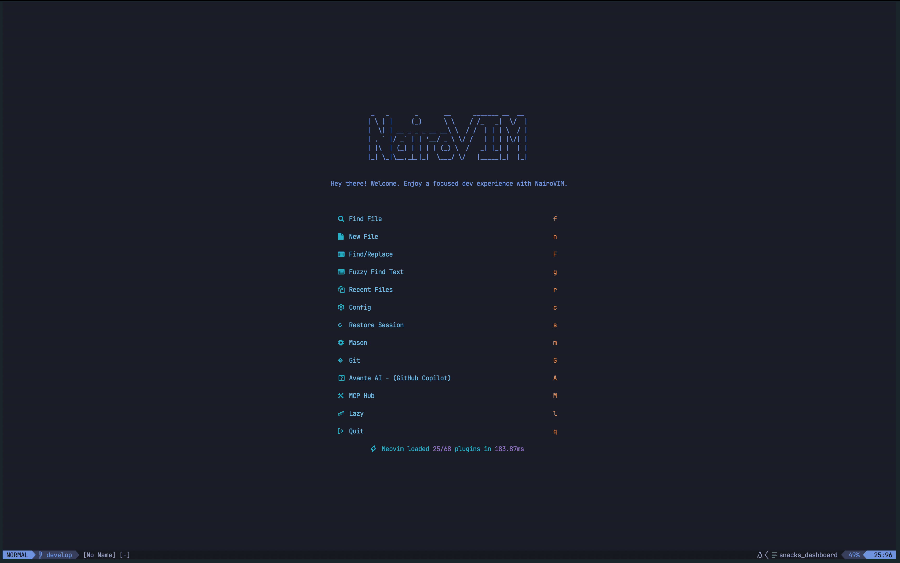
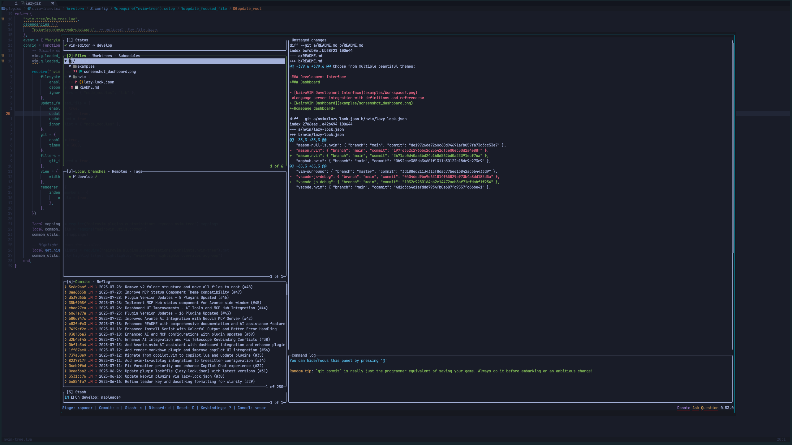
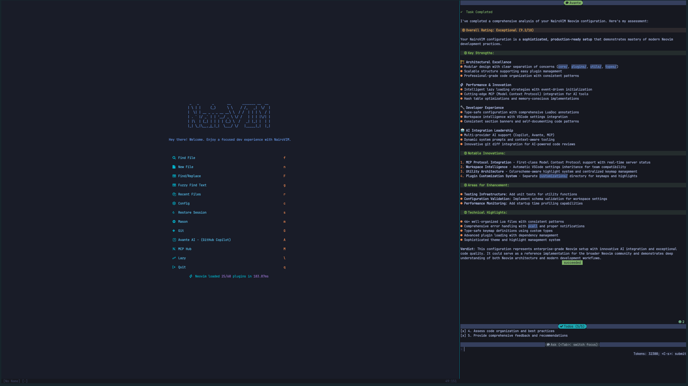
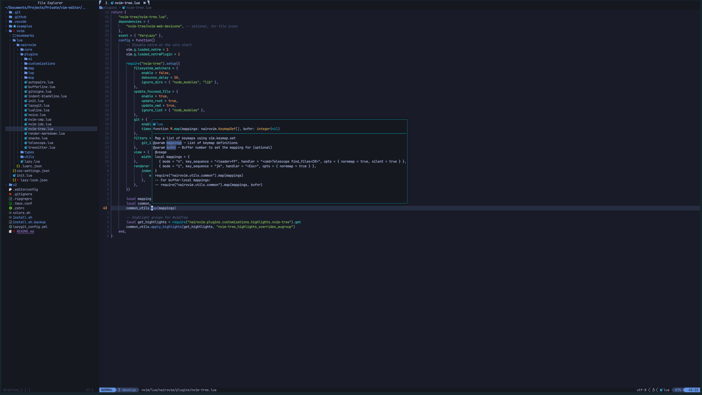
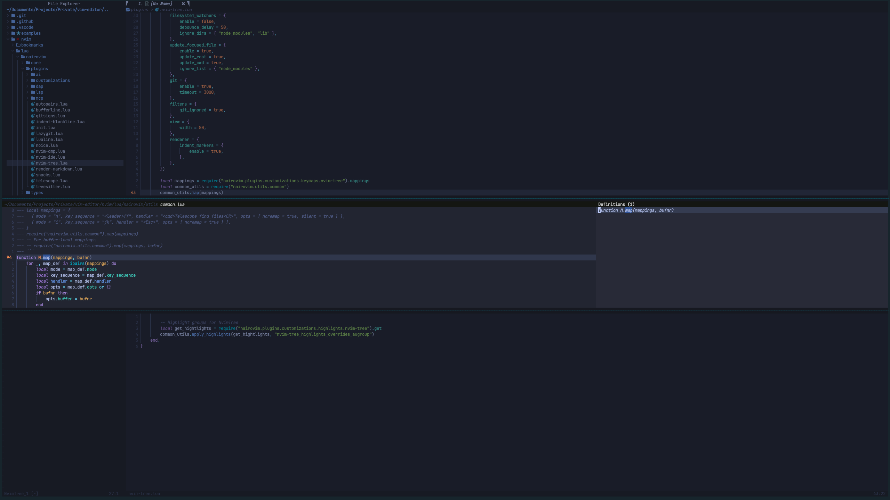

# NairoVIM

**A modern, AI-powered Neovim IDE configuration that transforms your terminal into a comprehensive development environment.**

Transform your coding experience with NairoVIM - a sophisticated Neovim configuration that combines the legendary efficiency of Vim with modern IDE features, AI assistance, and a beautifully integrated terminal workflow. Whether you're a seasoned developer or new to terminal-based editing, NairoVIM provides everything you need for productive development.

## 📑 Table of Contents

- [✨ Key Features](#-key-features)
- [📋 Prerequisites](#-prerequisites)
  - [System Requirements](#system-requirements)
  - [Optional but Recommended](#optional-but-recommended)
- [🚀 Quick Installation](#-quick-installation)
- [🎯 Quick Start Guide](#-quick-start-guide)
  - [📚 First Time? Start with the Interactive Tutorial!](#-first-time-start-with-the-interactive-tutorial)
  - [Starting a Development Session](#starting-a-development-session)
  - [Essential Workflows](#essential-workflows)
- [⌨️ Essential Keybindings](#️-essential-keybindings)
  - [File Navigation & Search](#file-navigation--search)
  - [LSP & Code Intelligence](#lsp--code-intelligence)
  - [AI Assistance (OpenCode)](#ai-assistance-opencode)
  - [Git Integration](#git-integration)
  - [Window Management](#window-management)
- [🤖 AI Assistance Setup](#-ai-assistance-setup)
  - [OpenCode - Primary AI Assistant (Recommended)](#opencode---primary-ai-assistant-recommended)
- [🎨 Post-Installation Setup](#-post-installation-setup)
  - [1. Configure Ghostty Terminal (Recommended)](#1-configure-ghostty-terminal-recommended)
  - [2. Install a Nerd Font](#2-install-a-nerd-font)
  - [3. Set Up Language Servers](#3-set-up-language-servers)
  - [4. Configure Git](#4-configure-git)
- [📸 Screenshots](#-screenshots)
- [🎨 Customization](#-customization)
  - [Change Theme](#change-theme)
  - [Manage Plugins](#manage-plugins)
  - [Disable Unwanted Plugins](#disable-unwanted-plugins)
- [🆘 Troubleshooting](#-troubleshooting)
- [📚 Documentation](#-documentation)
- [🤝 Contributing](#-contributing)
- [📄 License](#-license)
- [🙏 Acknowledgments](#-acknowledgments)

## ✨ Key Features

- 🤖 **AI-Powered Development** - Integrated OpenCode, Avante AI, and GitHub Copilot support
- 🎨 **Beautiful UI** - Multiple themes with enhanced status bars and visual elements
- 🔍 **Advanced Search** - Telescope fuzzy finder with FZF and Ripgrep integration
- 📁 **Smart File Management** - Tree-style file explorer with git integration
- 🌳 **Language Intelligence** - LSP support for 20+ programming languages
- 🐛 **Integrated Debugging** - Debug Adapter Protocol with visual debugging
- 📊 **Git Workflow** - Embedded Lazygit with diff viewing and conflict resolution
- ⚡ **Performance Optimized** - Lazy-loaded plugins for fast startup (~40-120ms)
- 🛠️ **Extensible** - 70+ carefully selected plugins with modular architecture

## 📋 Prerequisites

### System Requirements

#### macOS / Linux
- **Homebrew** - Package manager ([install here](https://brew.sh/))
- **Git** - Version control system
- **Ghostty Terminal** - Modern terminal emulator (recommended, [install here](https://ghostty.org/))
  - Alternative: iTerm2, Terminal.app, or any terminal with 256-color support

#### Windows
- **Windows 10/11** - With PowerShell 5.1 or later
- **Git for Windows** - Version control system
- **Windows Terminal** - Modern terminal emulator (recommended, built-in on Windows 11)
  - Alternative: PowerShell, CMD, or any terminal with 256-color support
- **Developer Mode** - Recommended for better symlink support (optional)

### Optional but Recommended

- **Nerd Font** - For proper icon display ([download here](https://www.nerdfonts.com/))
- **Node.js** - For additional LSP servers and tools
- **Python 3** - For certain Neovim plugins

## 🚀 Quick Installation

### macOS / Linux

1. **Clone the repository**:

   ```bash
   git clone https://github.com/yourusername/nairovim.git
   cd nairovim
   ```

2. **Run the installation script**:

   ```bash
   ./install.sh
   ```

3. **Install Ghostty terminal** (recommended):

   ```bash
   brew install --cask ghostty
   ```

4. **Start your development environment**:

   ```bash
   # Using Ghostty (recommended)
   ghostty
   nvim

   # Or with tmux (optional)
   tmux
   nvim
   ```

### Windows

1. **Clone the repository**:

   ```powershell
   git clone https://github.com/yourusername/nairovim.git
   cd nairovim
   ```

2. **Run the installation script** (in PowerShell as Administrator for best results):

   ```powershell
   .\install.ps1
   ```

3. **Enable Developer Mode** (recommended for better symlink support):
   - Open **Settings** → **System** → **For developers**
   - Enable **Developer Mode**

4. **Start your development environment**:

   ```powershell
   # Launch Windows Terminal
   wt
   
   # Start Neovim
   nvim
   ```

### What Gets Installed

The installation script will:

- ✅ Install Neovim and essential development tools
- ✅ Configure terminal (Ghostty on macOS/Linux, Windows Terminal on Windows)
- ✅ Set up shell (Oh My Zsh on macOS/Linux, Oh My Posh on Windows)
- ✅ Configure tmux (macOS/Linux only, optional for legacy workflows)
- ✅ Install and configure 70+ Neovim plugins
- ✅ Set up development utilities (FZF, Ripgrep, Lazygit, etc.)
- ✅ Install OpenCode AI assistant
- ✅ Create backups of existing configurations

<details>
<summary>Manual Installation (click to expand)</summary>

1. **Install Homebrew** (if not already installed):

   ```bash
   /bin/bash -c "$(curl -fsSL https://raw.githubusercontent.com/Homebrew/install/HEAD/install.sh)"
   ```

2. **Install core dependencies**:

   ```bash
   brew install neovim fzf ripgrep bat lazygit
   brew install --cask ghostty  # Recommended terminal
   ```

3. **Set up configuration files**:

   ```bash
   # Link dotfiles
   ln -sf "$(pwd)/ghostty_config" "$HOME/.config/ghostty/config"
   ln -sf "$(pwd)/.zshrc" "$HOME/.zshrc"

   # Link Neovim config
   ln -sf "$(pwd)/nvim" "$HOME/.config/nvim"

   # Optional: tmux (legacy support)
   ln -sf "$(pwd)/.tmux.conf" "$HOME/.tmux.conf"
   git clone https://github.com/tmux-plugins/tpm ~/.tmux/plugins/tpm
   ```

4. **Install Oh My Zsh**:

   ```bash
   sh -c "$(curl -fsSL https://raw.githubusercontent.com/ohmyzsh/ohmyzsh/master/tools/install.sh)"
   ```

</details>

## 🎯 Quick Start Guide

### 📚 First Time? Start with the Interactive Tutorial!

If you're new to NairoVIM, we **highly recommend** starting with the built-in interactive tutorial. It provides hands-on, step-by-step guidance for the essential features:

```bash
# From the dashboard (when you first open nvim)
Press 't' for Interactive Tutorial

# Or use the keybinding anytime
,tt  # (comma + t + t)

# Or use the command
:Tutorial
```

The tutorial covers:

**Beginner Lessons (17 min):**
- **Lesson 1:** File navigation basics (5 min)
- **Lesson 2:** Text editing fundamentals (5 min)
- **Lesson 3:** Search & find operations (7 min)

**Advanced Lessons (33 min):**
- **Lesson 4:** LSP & code intelligence (10 min)
- **Lesson 5:** AI-assisted coding (7 min)
- **Lesson 6:** Git workflow integration (8 min)
- **Lesson 7:** Power user tips (8 min)

**Total time:** ~50 minutes for complete mastery!

### Starting a Development Session

#### macOS / Linux

```bash
# Open Ghostty terminal (recommended)
ghostty

# Open Neovim
nvim

# Start interactive tutorial (first time users)
,tt

# Or jump right in:
# Find and open a file
<Ctrl-s>f

# Search for text across project
<Ctrl-s>s

# Open file explorer
<Ctrl-n>
```

#### Windows

```powershell
# Open Windows Terminal (recommended)
wt

# Open Neovim
nvim

# Start interactive tutorial (first time users)
,tt

# Or jump right in:
# Find and open a file
<Ctrl-s>f

# Search for text across project
<Ctrl-s>s

# Open file explorer
<Ctrl-n>
```

#### Terminal Split & Tab Management

**Ghostty (macOS/Linux):**
```bash
# Splits (tmux-like bindings)
<Ctrl-b> -      # Create horizontal split
<Ctrl-b> \      # Create vertical split
<Ctrl-b> h/j/k/l # Navigate between splits

# Tabs
<Ctrl-b> c      # Create new tab
<Ctrl-b> n/p    # Next/previous tab
<Ctrl-b> x      # Close tab

# Zoom
<Ctrl-b> z      # Toggle split zoom
```

**Windows Terminal:**
```powershell
# Splits
<Ctrl-b> -      # Create horizontal split
<Ctrl-b> =      # Create vertical split
<Ctrl-b> h/j/k/l # Navigate between splits

# Tabs
<Ctrl-b> c      # Create new tab
<Ctrl-b> n/p    # Next/previous tab
<Ctrl-b> x      # Close pane

# Zoom
<Ctrl-b> z      # Toggle pane zoom
```

> **Note:** tmux is supported on macOS/Linux but considered legacy. Modern terminals (Ghostty/Windows Terminal) provide native split/tab management with better performance.

### Essential Workflows

#### Git Workflow

```bash
# Open integrated Lazygit
,G

# Use vim-style navigation: j/k to move, space to stage
# Make commits and push directly from Neovim
```

#### AI-Assisted Coding

```bash
# Toggle OpenCode terminal (recommended)
,ot

# Ask about current code
,oa

# Add file context and ask questions
,o+
,oA
```

## ⌨️ Essential Keybindings

The leader key is `,` by default. Here are the most commonly used keybindings:

### File Navigation & Search

| Keybinding | Description |
|------------|-------------|
| `<C-S>f` | Find git files (Telescope) |
| `<C-S>s` | Live grep search across project |
| `<C-S>b` | Switch buffers |
| `<C-S>r` | Recent files |
| `<C-n>` | Toggle file explorer |
| `<C-F>f` | FZF git files (alternative) |

### LSP & Code Intelligence

| Keybinding | Description |
|------------|-------------|
| `gd` | Go to definition |
| `gi` | Go to implementation |
| `gR` | Find references |
| `K` | Hover documentation |
| `<leader>ca` | Code actions |
| `<leader>rn` | Rename symbol |
| `]e` / `[e` | Next/previous diagnostic |

### AI Assistance (OpenCode)

| Keybinding | Description |
|------------|-------------|
| `<leader>ot` | Toggle OpenCode terminal |
| `<leader>oa` | Ask about cursor/selection |
| `<leader>o+` | Add buffer/selection to context |
| `<leader>oe` | Explain code at cursor |
| `<leader>on` | New AI session |

### Git Integration

| Keybinding | Description |
|------------|-------------|
| `<leader>G` | Open Lazygit |
| `]c` / `[c` | Next/previous git hunk |
| `<leader>hs` | Stage hunk |
| `<leader>hp` | Preview hunk |
| `<leader>hb` | Blame line |

### Window Management

| Keybinding | Description |
|------------|-------------|
| `<leader>F` | Maximize current window |
| `<leader>s` | Find and replace (Scooter) |
| `<leader><CR>` | Clear search highlights |
| `jk` | Exit insert mode |

### Tutorial System

| Keybinding | Description |
|------------|-------------|
| `<leader>tt` | Start/resume interactive tutorial |
| `<leader>tl` | List all tutorial lessons |
| `<leader>tr` | Restart current lesson |
| `<leader>tn` | Start next lesson |

> 📖 **See complete keybinding reference**: Check [ARCHITECTURE.md](doc/ARCHITECTURE.md#complete-keybinding-reference) for all 70+ keybindings.

## 🤖 AI Assistance Setup

### OpenCode - Primary AI Assistant (Recommended)

**OpenCode** provides seamless AI assistance directly in your terminal with full context awareness.

#### Quick Setup

1. **Set your Anthropic API key**:

   ```bash
   # Add to ~/.zshrc or ~/.bashrc
   export ANTHROPIC_API_KEY="your-api-key-here"

   # Reload shell
   source ~/.zshrc
   ```

2. **Get your API key** from [Anthropic Console](https://console.anthropic.com/)

3. **Start using OpenCode**:

   ```bash
   # In Neovim
   ,ot  # Toggle OpenCode terminal
   ```

#### Basic Usage

```bash
# Ask about current code
,oa

# Add file to context
,o+

# Ask general question with context
,oA

# Explain code at cursor
,oe

# Start new session
,on
```

**Key Features:**

- ✅ Context-aware with multi-file support
- ✅ Session persistence
- ✅ Beautiful markdown rendering in terminal
- ✅ Fast & efficient
- ✅ Direct API calls (privacy-focused)

**Cost:** ~$0.01-$0.05 per query, ~$0.50-$2.00 daily for typical usage

> 📖 **For alternative AI tools** (Avante, Copilot): See [ARCHITECTURE.md - AI Tools](doc/ARCHITECTURE.md#ai-tools)

## 🎨 Post-Installation Setup

### 1. Configure Terminal

#### macOS / Linux (Ghostty)

Ghostty is pre-configured with the repository's settings. To customize further:

```bash
# Edit Ghostty config
nvim ~/.config/ghostty/config

# The config includes:
# - TokyoNight theme (dark/light auto-switch)
# - Tmux-like keybindings (Ctrl+b prefix)
# - Split and tab management
```

#### Windows (Windows Terminal)

Windows Terminal settings are automatically configured during installation. To customize:

1. Open Windows Terminal
2. Press `Ctrl+,` to open Settings
3. Customize themes, fonts, and keybindings

Or manually edit the JSON config:
```powershell
# Edit Windows Terminal settings
notepad "$env:LOCALAPPDATA\Packages\Microsoft.WindowsTerminal_*\LocalState\settings.json"
```

### 2. Install a Nerd Font

#### macOS / Linux

```bash
# Recommended: Hack Nerd Font
brew tap homebrew/cask-fonts
brew install --cask font-hack-nerd-font
```

#### Windows

Nerd Fonts are automatically installed via the PowerShell script (JetBrainsMono Nerd Font). To install additional fonts:

```powershell
# Via Scoop
scoop install FiraCode-NF-Mono
scoop install Hack-NF-Mono

# Or download manually from https://www.nerdfonts.com/
```

To set the font in Windows Terminal:
1. Press `Ctrl+,` → **Defaults** → **Appearance**
2. Set **Font face** to "JetBrainsMono Nerd Font Mono"

### 3. Set Up Language Servers

```bash
# In Neovim, open Mason
:Mason

# Install language servers for your languages:
# - TypeScript: typescript-language-server
# - Python: pyright
# - Rust: rust-analyzer
# - Go: gopls
# Navigate with j/k, press 'i' to install
```

### 4. Configure Git

Add to `~/.gitconfig`:

```yaml
[core]
  editor = nvim
[merge]
  tool = nvim
[mergetool "nvim"]
  cmd = nvim -c "DiffviewOpen"
```

## 📸 Screenshots

### Dashboard



### Git Integration



### AI Assistant



### LSP Support




## 🎨 Customization

### Change Theme

```bash
# In Neovim
:colorscheme <Tab>

# Available themes:
# - tokyonight-night (default dark)
# - tokyonight-day (light)
# - catppuccin
# - gruvbox
# - nightfox
```

Or use keybindings:

- `<leader>DD` - Dark theme (tokyonight-night)
- `<leader>LL` - Light theme (tokyonight-day)

### Manage Plugins

```bash
# Open plugin manager
:Lazy

# Common operations:
# - Update plugins: U
# - Install new: I
# - Clean unused: X
# - View logs: L

# Open LSP/tool manager
:Mason
```

### Disable Unwanted Plugins

Edit the plugin file (e.g., `lua/nairovim/plugins/plugin-name.lua`):

```lua
return {
  "plugin/name",
  enabled = false,  -- Add this line
}
```

## 🆘 Troubleshooting

### Quick Fixes

**Plugins not loading:**

```bash
:Lazy restore
:Lazy sync
```

**LSP not working:**

```bash
:LspInfo
:Mason  # Install language servers
```

**Icons not showing:**

```bash
# Install Nerd Font and configure terminal to use it
brew install --cask font-hack-nerd-font
```

**Slow startup:**

```bash
# Profile plugins
:Lazy profile

# Disable unused plugins (see Customization above)
```

> 📖 **Comprehensive troubleshooting guide**: See [TROUBLESHOOTING.md](doc/TROUBLESHOOTING.md)

## 📚 Documentation

- **[ARCHITECTURE.md](doc/ARCHITECTURE.md)** - Technical details, plugin ecosystem, complete keybindings
- **[TROUBLESHOOTING.md](doc/TROUBLESHOOTING.md)** - Detailed issue resolution guide
- **[FAQ.md](doc/FAQ.md)** - Frequently asked questions
- **[CONTRIBUTING.md](doc/CONTRIBUTING.md)** - Contribution guidelines

## 🤝 Contributing

We welcome contributions! Please see [CONTRIBUTING.md](doc/CONTRIBUTING.md) for guidelines.

## 📄 License

This project is licensed under the MIT License - see the [LICENSE](LICENSE) file for details.

## 🙏 Acknowledgments

NairoVIM is built on the shoulders of giants. Special thanks to:

- The Neovim team for the amazing editor
- All plugin authors who make this configuration possible
- The open source community for continuous inspiration

---

```txt
.oPYo.                    8     o                         88 88 88
8    8                    8     8                         88 88 88
8      .oPYo. .oPYo. .oPYo8    o8P .oPYo.   .oPYo. .oPYo. 88 88 88
8   oo 8    8 8    8 8    8     8  8    8   8    8 8    8 88 88 88
8    8 8    8 8    8 8    8     8  8    8   8    8 8    8 `' `' `'
`YooP8 `YooP' `YooP' `YooP'     8  `YooP'   `YooP8 `YooP' 88 88 88
:....8 :.....::.....::.....:::::..::.....::::....8 :.....:.........
:::::8 :::::::::::::::::::::::::::::::::::::::ooP'.::::::::::::::::
:::::..:::::::::::::::::::::::::::::::::::::::...::::::::::::::::::
```

**Ready to transform your coding experience? [Get started now](#-quick-installation)!**
