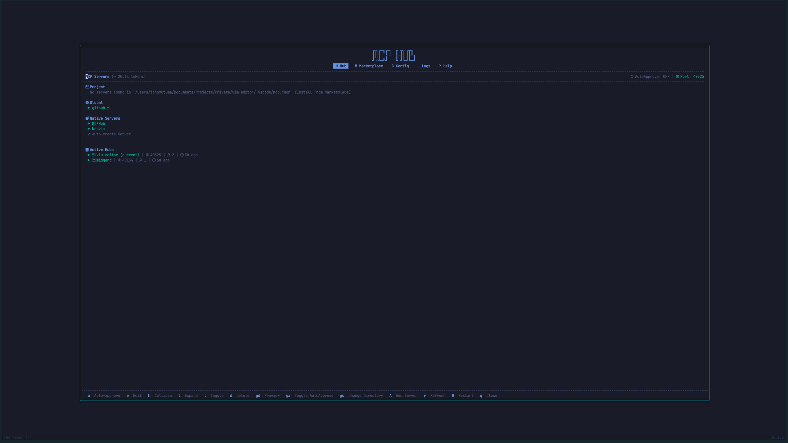

# NairoVIM

**A modern, AI-powered Neovim IDE configuration that transforms your terminal into a comprehensive development environment.**

Transform your coding experience with NairoVIM - a sophisticated Neovim configuration that combines the legendary efficiency of Vim with modern IDE features, AI assistance, and a beautifully integrated terminal workflow. Whether you're a seasoned developer or new to terminal-based editing, NairoVIM provides everything you need for productive development.

## ✨ Key Features

- 🤖 **AI-Powered Development** - Advanced AI ecosystem with Avante, GitHub Copilot, and MCP integration
- 🎨 **Beautiful UI** - Multiple themes with enhanced status bars and visual elements
- 🔍 **Advanced Search** - Telescope fuzzy finder with FZF and Ripgrep integration
- 📁 **Smart File Management** - Tree-style file explorer with git integration
- 🌳 **Language Intelligence** - LSP support for 20+ programming languages
- 🐛 **Integrated Debugging** - Debug Adapter Protocol with visual debugging
- 📊 **Git Workflow** - Embedded Lazygit with diff viewing and conflict resolution
- ⚡ **Performance Optimized** - Lazy-loaded plugins for fast startup
- 🛠️ **Extensible** - 70+ carefully selected plugins with modular architecture

## 📋 Prerequisites

Before installing NairoVIM, ensure you have these requirements:

### System Requirements

- **macOS or Linux** (Windows WSL supported)
- **Homebrew** - Package manager for macOS/Linux ([install here](https://brew.sh/))
- **Git** - Version control system
- **Terminal with 256-color support** - iTerm2, Terminal.app, or equivalent

### Optional but Recommended

- **Nerd Font** - For proper icon display ([download here](https://www.nerdfonts.com/))
- **Node.js** - For additional LSP servers and tools
- **Python 3** - For certain Neovim plugins

## 🚀 Installation

### Quick Installation

1. **Clone the repository**:

   ```bash
   git clone https://github.com/yourusername/nairovim.git
   cd nairovim
   ```

2. **Run the installation script**:

   ```bash
   ./install.sh
   ```

3. **Start your development environment**:

   ```bash
   tmux
   nvim
   ```

That's it! The installation script will:

- ✅ Install Neovim and essential development tools
- ✅ Set up tmux with enhanced configuration
- ✅ Configure zsh with Oh My Zsh
- ✅ Install and configure 70+ Neovim plugins
- ✅ Set up development utilities (FZF, Ripgrep, Lazygit, etc.)
- ✅ Create backups of existing configurations

### Manual Installation Steps

If you prefer manual installation or encounter issues:

<details>
<summary>Click to expand manual installation steps</summary>

1. **Install Homebrew** (if not already installed):

   ```bash
   /bin/bash -c "$(curl -fsSL https://raw.githubusercontent.com/Homebrew/install/HEAD/install.sh)"
   ```

2. **Install core dependencies**:

   ```bash
   brew install neovim tmux fzf ripgrep bat
   ```

3. **Set up configuration files**:

   ```bash
   # Link dotfiles
   ln -sf "$(pwd)/.vimrc" "$HOME/.vimrc"
   ln -sf "$(pwd)/.tmux.conf" "$HOME/.tmux.conf"
   ln -sf "$(pwd)/.zshrc" "$HOME/.zshrc"

   # Link Neovim config
   ln -sf "$(pwd)/nvim" "$HOME/.config/nvim"
   ```

4. **Install tmux plugins**:

   ```bash
   git clone https://github.com/tmux-plugins/tpm ~/.tmux/plugins/tpm
   ```

5. **Install Oh My Zsh**:

   ```bash
   sh -c "$(curl -fsSL https://raw.githubusercontent.com/ohmyzsh/ohmyzsh/master/tools/install.sh)"
   ```

</details>

## 🎯 Quick Start Guide

### Essential Shortcuts (Leader key: `,`)

#### **File Navigation & Search**

- `<C-f>f` - Find git files (FZF)
- `<C-f>s` - Search text in project (Ripgrep)
- `<C-f>b` - Switch between open buffers (FZF)
- `<C-f>y` - Switch git branches (FZF)
- `<C-S>f` - Find git files (Telescope)
- `<C-S>s` - Live grep search (Telescope)
- `<C-S>b` - Switch buffers (Telescope)
- `<C-S>r` - Recent files (Telescope)
- `<C-S>y` - Git branches (Telescope)
- `<C-n>` - Toggle file explorer (NvimTree)

#### **Code Intelligence (LSP)**

- `gd` - Go to definition (Glance)
- `gi` - Go to implementation (Glance)
- `gR` - Find references (Glance)
- `gT` - Go to type definition (Glance)
- `K` - Show hover documentation (Lspsaga)
- `<leader>d` - Show line diagnostics (Lspsaga)
- `<leader>D` - Show buffer diagnostics (Lspsaga)
- `<leader>wd` - Show workspace diagnostics (Lspsaga)
- `<leader>ca` - Code actions (Lspsaga)
- `<leader>rn` - Rename symbol (Lspsaga)
- `]e` - Next diagnostic (Lspsaga)
- `[e` - Previous diagnostic (Lspsaga)

#### **AI Assistant**

- `<leader>cp` - Chat with GitHub Copilot
- `:CopilotChat` - Open Copilot chat interface
- `:Copilot auth` - Authenticate with GitHub
- `:AvanteAsk` - Ask Avante AI for code assistance
- `:AvanteChat` - Open Avante chat interface
- `:AvanteEdit` - Edit code with Avante suggestions

#### **Git Integration**

- `<leader>G` - Open Lazygit interface
- `]c` - Next git hunk (Gitsigns)
- `[c` - Previous git hunk (Gitsigns)
- `<leader>hs` - Stage hunk (Gitsigns)
- `<leader>hr` - Reset hunk (Gitsigns)
- `<leader>hp` - Preview hunk (Gitsigns)
- `<leader>hb` - Blame line (Gitsigns)

#### **UI & Window Management**

- `<leader>tr` - Toggle right panel (nvim-ide)
- `<leader>tl` - Toggle left panel (nvim-ide)
- `<leader>F` - Toggle window maximizer
- `gq` - Close current window
- `<C-T>o` - Close all other tabs
- `<leader><CR>` - Clear search highlights

### Common Workflows

#### **Starting a Development Session**

```bash
# Start tmux session
tmux

# Open Neovim
nvim

# Find and open a file
<C-f>f

# Search for text across project
<C-f>g
```

#### **Git Workflow**

```bash
# Open git interface
<leader>G

# Stage changes, commit, and push directly in Lazygit
# Use vim-style navigation: j/k to move, space to stage
```

#### **AI-Assisted Coding**

```bash

# Use Avante AI for advanced assistance
:AvanteAsk

# Ask questions like:
# "Explain this function"
# "Optimize this code"
# "Write unit tests for this"
# "Generate PR description" (Avante slash command)

# Open Copilot Chat - but Prefers AvanteChat which integrates GitHub Copilot
<leader>cp

```

## 🛠️ Post-Installation Setup

### Font Configuration

1. **Install a Nerd Font** (recommended: Hack Nerd Font):

   ```bash
   brew tap homebrew/cask-fonts
   brew install --cask font-hack-nerd-font
   ```

2. **Configure your terminal** to use the Nerd Font for proper icon display

### Git Configuration

Add these settings to your `~/.gitconfig` for optimal git integration:

```yaml
[core]
  editor = nvim
[merge]
  tool = nvim
[mergetool "nvim"]
  cmd = nvim -c "DiffviewOpen"
[mergetool]
  prompt = false
```

## 🤖 AI Assistance Setup

NairoVIM features a powerful AI ecosystem with three integrated systems:

### Avante AI - Advanced Code Assistant

**Avante** is an AI-powered coding assistant that provides context-aware suggestions and code generation.

**Key Features:**

- **Context-Aware**: Automatically includes project context and MCP server information
- **Multiple Providers**: Supports Claude Sonnet, GitHub Copilot, and other AI models
- **Slash Commands**: Custom commands like `/pr_description` for generating PR descriptions
- **Code Editing**: Direct code modification with AI suggestions
- **File Integration**: Automatically includes relevant project files (like .github directory)

**Usage:**

```bash
# Ask Avante for assistance
:AvanteAsk

# Open interactive chat
:AvanteChat

# Edit selected code with AI
:AvanteEdit

# Use slash commands in chat
/pr_description  # Generate PR title and description
```

### GitHub Copilot - Code Completion

**Setup:**

1. **Authenticate with GitHub**:

   ```bash
   # In Neovim
   :Copilot auth
   ```

2. **Check status**:

   ```bash
   :Copilot status
   ```

**Usage:**

- Real-time code suggestions as you type
- Chat interface with `<leader>cp`
- Context-aware completions

### MCPHub - Model Context Protocol Integration

**MCPHub** enables integration with external tools and services through the Model Context Protocol.

**Key Features:**

- **Tool Integration**: Connect to external APIs, databases, and services
- **Context Sharing**: Share workspace context with AI assistants
- **Extensible**: Add custom MCP servers for specialized workflows
- **Avante Integration**: Seamlessly works with Avante for enhanced capabilities

**Available MCP Servers:**

- **Neovim**: Direct editor integration and file operations
- **Fetch**: Web content retrieval and processing
- **Additional servers**: Can be added based on your workflow needs

**Usage:**

```bash
# Explore and manage MCP servers
:MCPHub

# MCPHub integrates automatically with Avante
# No manual setup required - works behind the scenes
# Provides additional context and capabilities to AI assistants
```

### Language Server Setup

1. **Open Mason** (LSP manager):

   ```bash
   # In Neovim
   :Mason
   ```

2. **Install language servers** for your preferred languages:
   - TypeScript: `typescript-language-server`
   - Python: `pyright`
   - Rust: `rust-analyzer`
   - Go: `gopls`
   - And many more...

## 🎨 Customization

### Theme Selection

Choose from multiple beautiful themes:

```bash
# In Neovim
:colorscheme <Tab><Tab>

# Available themes:
# - catppuccin (default)
# - gruvbox
# - tokyonight
# - dracula
# - monokai
```

### Plugin Management

```bash
# Install/update plugins
:Lazy

# Mason (LSP/tools)
:Mason

# Check plugin status
:Lazy health
```

## 📱 Screenshots

### Dashboard


*Homepage dashboard*

### Git Integration


*Seamless git workflow with embedded Lazygit*

### AI Assistant


*AI-powered coding assistance with Avante AI - GitHub Copilot*


*MCP hub to manage your active MCP servers*

### LSP support


*LSP hoverdocs*


*LSP hoverdocs*

## 🔧 Advanced Configuration

### Working with Language Servers

- **Install LSP servers**: `:Mason` → Browse and install
- **Configure formatters**: `:NullLsInstall` for current filetype
- **Debug adapters**: `:DapInstall` for debugging support

### Tmux Enhancements

- **Plugin management**: `prefix + I` to install plugins
- **Session management**: `prefix + S` to synchronize panes
- **Smart navigation**: `prefix + h/j/k/l` for vim-style pane navigation

### Terminal Optimization

Set up italic text support in iTerm2:

```bash
# Follow instructions at:
# https://weibeld.net/terminals-and-shells/italics.html
```

## 🆘 Troubleshooting

### Common Issues

**Plugins not loading:**

```bash
# In Neovim
:Lazy restore
:Lazy sync
```

**LSP not working:**

```bash
# Check LSP status
:LspInfo

# Install language server
:Mason
```

**Git integration issues:**

```bash
# Verify git configuration
git config --list

# Check Lazygit installation
lazygit --version
```

**Font icons not displaying:**

- Ensure Nerd Font is installed and selected in terminal
- Verify terminal supports Unicode

## 🤝 Contributing

We welcome contributions! Please see our [contributing guidelines](CONTRIBUTING.md) for details.

## 📄 License

This project is licensed under the MIT License - see the [LICENSE](LICENSE) file for details.

## 🙏 Acknowledgments

NairoVIM is built on the shoulders of giants. Special thanks to:

- The Neovim team for the amazing editor
- All plugin authors who make this configuration possible
- The open source community for continuous inspiration

---

```txt
.oPYo.                    8     o                         88 88 88
8    8                    8     8                         88 88 88
8      .oPYo. .oPYo. .oPYo8    o8P .oPYo.   .oPYo. .oPYo. 88 88 88
8   oo 8    8 8    8 8    8     8  8    8   8    8 8    8 88 88 88
8    8 8    8 8    8 8    8     8  8    8   8    8 8    8 `' `' `'
`YooP8 `YooP' `YooP' `YooP'     8  `YooP'   `YooP8 `YooP' 88 88 88
:....8 :.....::.....::.....:::::..::.....::::....8 :.....:.........
:::::8 :::::::::::::::::::::::::::::::::::::::ooP'.::::::::::::::::
:::::..:::::::::::::::::::::::::::::::::::::::...::::::::::::::::::
```

**Ready to transform your coding experience? [Get started now](#-installation)!**
