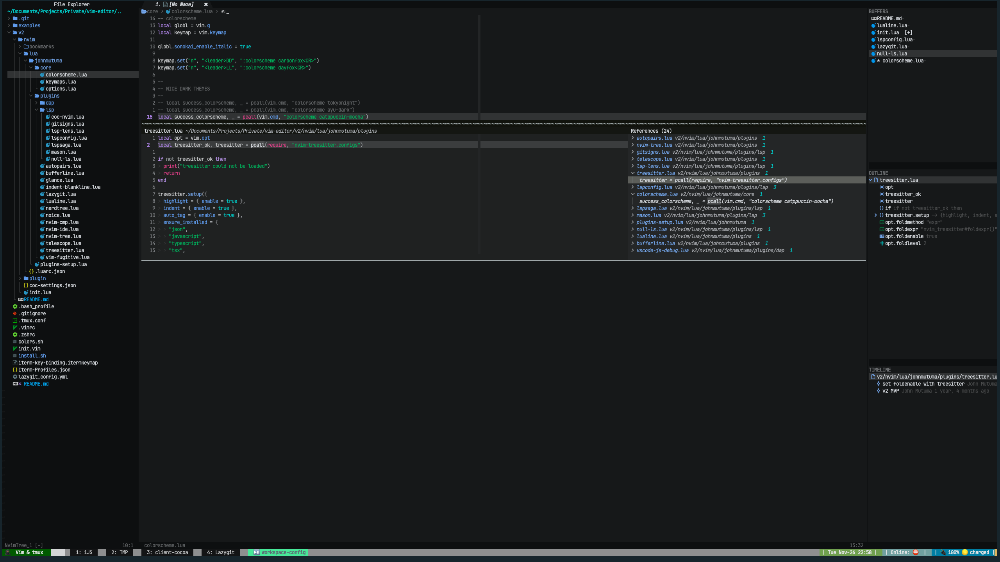
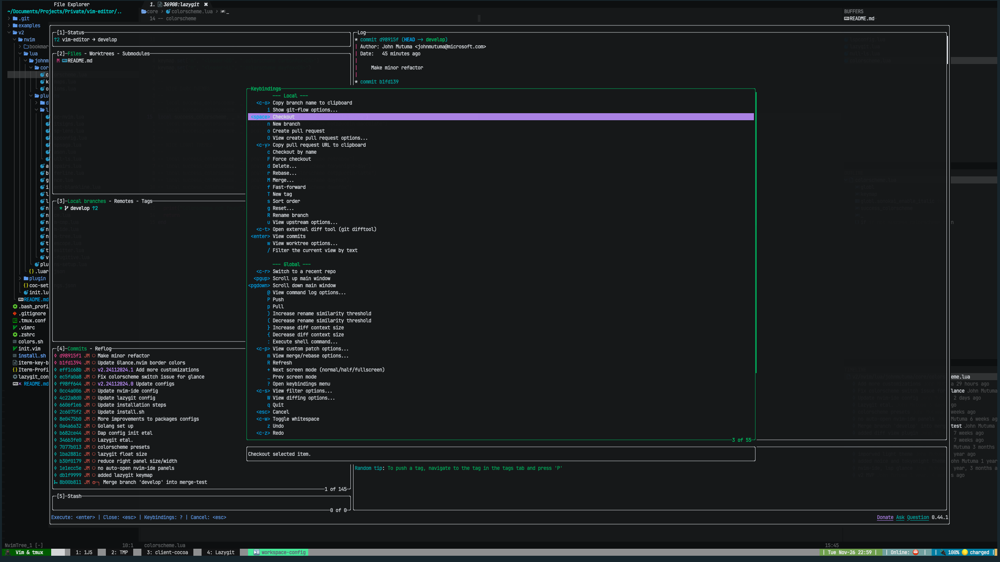

# NairoVim

A NICE configuration for NeoVim with a lot of features and plugins to make your
development experience better. Get the best of both worlds with NeoVim as a
modern IDE.

## Installation

### Prerequisites

#### Automated setup

Find a Release version and download the zip file. Extract the zip file in your
desired location,

- in the root directory of the extracted files, run `./install.sh`
- sit back and relax as the script installs all the necessary plugins and configurations
- run `> tmux` and run `> nvim` in your terminal to open NeoVim in a tmux
  session and start using the IDE
- run `:PackerInstall` in NeoVim to install all the plugins
- choose your favourite theme by running `:colorscheme <theme-name>`

#### Setting up terminal devicons

This will enable Vim/NeoVim to display nerd icons e.g. File Extension icons in
the File Explorer

- Download and install a [patched Nerd Font](https://github.com/ryanoasis/nerd-fonts)
  - such as [Hack Nerd Font](https://github.com/ryanoasis/nerd-fonts/releases/download/v2.1.0/Hack.zip)
  - ensure that the font installed has nerd devicons - You can use Font Book if
    using MacOS to check out the installed font
- Open you terminal emulator e.g. ITerm and set the Font Type to the patched font

#### Configuring a mergetool for merge conflicts

Add the following to your `~/.gitconfig` file
This will open a 3-way merge tool in NeoVim when you have merge conflicts. e.g.
when opening a conflicted file within lazygit `:LazyGit` UI

```yaml
[core]
 editor = nvim
[merge]
  tool = nvim
[mergetool "nvim"]
  cmd = nvim -c "DiffviewOpen"
[mergetool]
  prompt = false
```

## Useful keyboard mappings/shortcuts and useful commands to use the IDE like a pro

The `<leader>` key is `,` by default

### Normal mode

- `<leader>tr` - Toggle right panel
- `<leader>DD` - Toggle dark theme
- `<leader>LL` - Toggle light theme

### Searching

- `<C-p>` - Searches MRU files with CtrlP
- `<C-f>f` - Searches git files ,. mnemonic: find files
- `<C-f>Y` - Searches git branches with ,. mnemonic: find Y (branch sign)
- `<C-f>b` - Searches for buffers opened recently,. mnemonic: find buffers
- `:Rg <search-term>` - fuzzy search for a term in the project. `<search-term>`
  can be a regular expression to search powerfully. uses
  [Ripgrep](https://github.com/BurntSushi/ripgrep) with [FZF](https://github.com/junegunn/fzf)

### Basic Movement

- `j` - Cursor down a line
- `k` - Cursor up a line
- `<C-e>` - Scroll down
- `<C-y>` - Scroll up

### Window and Tab management

- `<C-n>` - Toggle File Explorer
- `gq` - Quit current buffer/file,. mnemonic: go quit
- `<C-t>o` - Quit all tabs except current,. mnemonic: Tab only
- `<C-w>o` - Quit all window in current tab except current window,.
  mnemonic: Window only

### LSP keymaps

- `gd` - Go to Definition
- `gi` - Go to Implementation
- `gR` - Go to References
- `<leader>d` - view code diagnostics for the current line,.
  mnemonic: diagnostics e.g eslint, stylua, gofumpt,.. errors
- `<leader>D` - view code diagnostics for the current file,. mnemonic: Diagnostics
- `<leadeer>wd` - view code diagnostics for the workspace,. mnemonic: workspace diagnostics
- `K` - Hover docs

### Git and version control UIs

- `:LazyGit` - open embedded lazygit
- `<leader>G` - open embedded lazygit
- `:G` - open vim-fugitive git status window. A git repo alternative to lazygit

### Others

- `:colorscheme <Tab><Tab>` - choose your favourite theme
- `:CtrlP <Tab><Tab>` - CtrlP commands e.g. search MRU files
- `:<Tab><Tab>` - see all available commands

## Screenshots (carbonfox colorscheme)

Definitions and References provided by language servers


Embedded lazygit view



## Advanced

Once you get comfortable and excited, let's go,

### Working with Language Servers, Debuggers and Linters

- Run `:Mason` and find and install some LSP extensions and Linters you might want
  - You can also do `:LspInstall` to install language servers and
    `:NullLsInstall` to install formatting and linting sources for the current filetype
- `:DapInstall` to edit installed debug adapters file. Learn to install
  and configure [debug adapters](https://github.com/mfussenegger/nvim-dap/wiki/Debug-Adapter-installation)
  with `nvim-dap`. A best practice is to configure with `.vscode/launch.json`
  configurations after installing the debug adapter
- Find [Coc.nvim](https://github.com/neoclide/coc.nvim/wiki/Using-coc-extensions#implemented-coc-extensions)
  extensions that you might like e.g. `coc-marketplace`

### Setting up italic text in iTerm2

Follow the instructions
<https://weibeld.net/terminals-and-shells/italics.html>

```txt
.oPYo.                    8     o                         88 88 88
8    8                    8     8                         88 88 88
8      .oPYo. .oPYo. .oPYo8    o8P .oPYo.   .oPYo. .oPYo. 88 88 88
8   oo 8    8 8    8 8    8     8  8    8   8    8 8    8 88 88 88
8    8 8    8 8    8 8    8     8  8    8   8    8 8    8 `' `' `'
`YooP8 `YooP' `YooP' `YooP'     8  `YooP'   `YooP8 `YooP' 88 88 88
:....8 :.....::.....::.....:::::..::.....::::....8 :.....:.........
:::::8 :::::::::::::::::::::::::::::::::::::::ooP'.::::::::::::::::
:::::..:::::::::::::::::::::::::::::::::::::::...::::::::::::::::::
```
